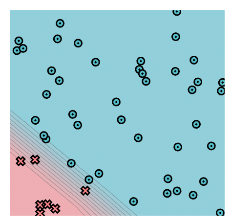

# MiniTorch Module 1

* Docs: https://minitorch.github.io/

* Overview: https://minitorch.github.io/module1.html

This assignment requires the following files from the previous assignments.

        minitorch/operators.py minitorch/module.py tests/test_module.py tests/test_operators.py project/run_manual.py

## Task 1.5 - Training
### Simple
* Hyperparamters
  * PTS = 50
  * HIDDEN = 2
  * RATE = 0.05
  * EPOCH = 500
* Training log
  
* Final classification result
  

### Diag
* Hyperparamters
  * PTS = 50
  * HIDDEN = 10
  * RATE = 0.1
  * EPOCH = 300
* Training log
  
* Final classification result
  

### Split
* Hyperparamters
  * PTS = 80
  * HIDDEN = 10
  * RATE = 0.1
  * EPOCH = 500
* Training log
  
* Final classification result
  

### Xor
* Hyperparamters
  * PTS = 80
  * HIDDEN = 10
  * RATE = 0.1
  * EPOCH = 500
* Training log
  
* Final classification result
  